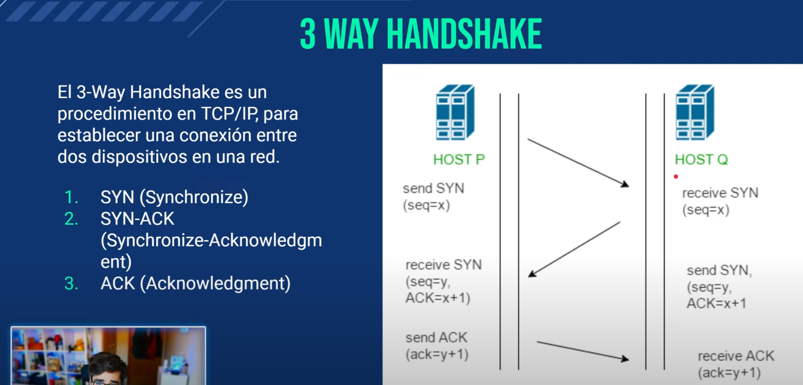

### NMAP
Descubirmiento de redes y auditoría de seguridad
- Descubrir hosts y servicios en una red enviadno paquetes y analizando respuestas
- Recopilar información sobre los sistemas operativod
- Descubrir puertos aiertos, servicios ejecutándose y sus versiones
- Descubrir vulnerabilidades

### Scanning
```bash
namp [red]
nmap 10.10.10.0/24
```

### Descubrimiento de host
LA opción `-sn` o  `-sP` omite el escaneo de puertos, centrando la tarea en el descubrimiento de host activos mediente un ping. Es ideal para enumerar dispositivos en una red sin realizar un aanálisi profundo de los servicios que ofrecen.

```bash
nmap -sn 10.10.10.0/24
```

### Especificando hosts y redes para el escaneo
`-iL` Lee desde un archivo una lista de direcciones

`IP1 IP2 IP3` Ecanea las direcciones especificadas

`IP - IP` Escanea un rango de direcciones

```bash
nmap -sn 10.10.10.1-4
nmap -sn 10.10.10.1 10.10.10.4
```

### Opciones de escaneo avanzado
`-p[puerto(s)]` Especifica los puertos a escanear

`-T[0 - 5]` Ajusta la velocidad del escaneo

`-oN[ archivo ]` Guarda el resultado del escaneo en un archivo

```bash
nmap 10.10.10.4 -p 22,23 -T5 -oN scan-10.10.10.4
```

### Standard (TCP)
```bash
nmap -sT 10.10.10.4 # Standard if dont put -sT (TCP)
```

### 3 way handshake


### Escaneo UDP
```bash
sudo nmap 10.10.10.4 -sU -T5
```

### Escaneo sin ping
Asume que los hosts estan activos

```bash
nmap -Pn --open -sT 10.10.10.4
```

### Escanear todos
```bash
nmap -p- 10.10.10.4
```

### Descubrimiento de versiones
```bash
nmap -p 22,23,445 10.10.10.4 -sT -T5 -Pn --open -sV
```

### Scripts NSE
https://nmap.org/nsedoc/categories/default.html

```bash
nmap -p 21,139,445 10.10.10.4 -T5 -sT -Pn --open -sV -sC
```


